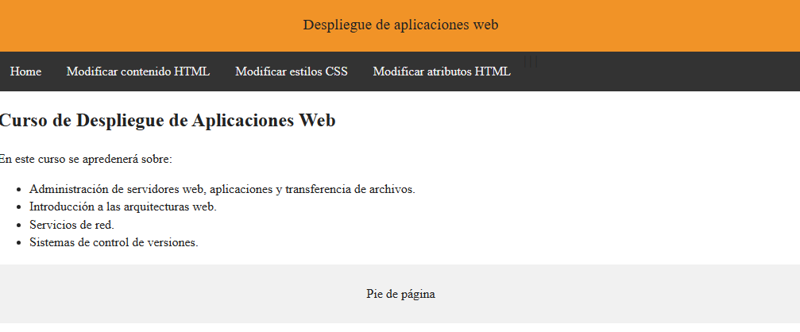

**¿Qué es Git?**

Git es una herramienta que realiza una función del control de versiones
de código de forma distribuida, de la que destacamos varias
características:

⦁ Es muy potente

⦁ Fue diseñada por Linus Torvalds

⦁ No depende de un repositorio central

⦁ Es software libre

⦁ Con ella podemos mantener un historial completo de versiones

⦁ Podemos movernos, como si tuviéramos un puntero en el tiempo, por
todas las revisiones de código y desplazarnos una manera muy ágil.

⦁ Es muy rápida

⦁ Tiene un sistema de trabajo con ramas que lo hace especialmente
potente

⦁ En cuanto a la funcionalidad de las ramas, las mismas están destinadas
a provocar proyectos divergentes de un proyecto principal, para hacer
experimentos o para probar nuevas funcionalidades.

⦁ Las ramas pueden tener una línea de progreso diferente de la rama
principal donde está el core de nuestro desarrollo. En algún momento
podemos llegar a probar algunas de esas mejoras o cambios en el código y
hacer una fusión a nuestro proyecto principal, ya que todo esto lo
maneja Git de una forma muy eficiente

**¿Qué es Git Flow?**

Gitflow es un modelo alternativo de creación de ramas en Git en el que
se utilizan ramas de función y varias ramas principales. Según este
modelo, los desarrolladores crean una rama de función y retrasan su
fusión con la rama principal del tronco hasta que la función está
completa.

**¿Por qué utilizar Git Flow?**

Se utiliza Git Flow ya que permite dividir tu proyecto en varias ramas
de desarrollo dedicadas a tareas muy específicas de tu proyecto,
permitiendo que sean muchos los desarrolladores que puedan estar
integrados en el mismo proyecto al mismo tiempo.

**Parte práctica**

El usuario 1 implementa la estructura inicial utilizando el boilerplate
y modificándolo acorde a lo que se pide en la práctica.

{width="6.86698709536308in"
height="1.9102559055118111in"}

{width="6.875in"
height="1.8012817147856517in"}

{width="6.850962379702537in"
height="3.7235575240594927in"}

El usuario 1 inicia el proyecto

{width="6.8171522309711285in"
height="0.9644433508311461in"}

El usuario 1 realiza los pasos para tener el proyecto en GitHub

{width="6.5536854768153985in"
height="6.274037620297463in"}El usuario 1 crea la rama de desarrollo
para utilizar la metodología Git Flow

{width="5.0in"
height="1.2708333333333333in"}

El usuario 2 crea las ramas feature/contenidoHTML y
feature/atributosHTML basadas en la rama de desarrollo

{width="6.338529090113735in"
height="2.997596237970254in"}El usuario 2 completa la feature
contenidoHTML

{width="6.338140857392826in"
height="3.6708398950131236in"}

El usuario 2 fusiona la rama de feature/contenidoHTML con la de
desarrollo

{width="6.538462379702537in"
height="1.2564107611548556in"}

{width="6.579861111111111in"
height="0.6354166666666666in"}

El usuario 2 completa la feature atributosHTML

{width="6.498396762904637in"
height="3.8305621172353455in"}El usuario 2 fusiona la rama de
feature/atributosHTML con la de desarrollo

{width="6.482372047244095in"
height="1.0803958880139983in"}

{width="6.469907042869641in"
height="1.2708333333333333in"}

El usuario 3 crea la rama feature/estilosCSS basada en la rama de
desarrollo

{width="6.39423009623797in"
height="0.8259219160104987in"}

El usuario 3 completa la feature estilosCSS

{width="6.39423009623797in"
height="4.18169072615923in"}

El usuario 3 fusiona la rama feature/estilosCSS con la de desarrollo

{width="6.421809930008749in"
height="1.1505741469816273in"}{width="6.446758530183727in"
height="0.5833333333333334in"}El usuario 1 da el visto bueno así que
fusiona la rama de desarrollo con la master

{width="6.568287401574803in"
height="2.0104166666666665in"}El usuario 1 etiqueta la versión como 1.0

{width="6.603009623797026in"
height="0.9375in"}El usuario 1 crea la rama test para la realización de
pruebas

{width="6.6232633420822395in"
height="1.2708333333333333in"}

**El usuario 1 crea los hooks:**

Para la creación de un hook que se active cuando se haga un clonado o un
checkout del proyecto hay que ir a la ruta
**carpeta_proyecto/.git/hooks/** y crear un fichero llamado
**post-checkout**

En este caso, utilizará el entorno bash para que se recree la carpeta
node_modules

{width="6.819083552055993in"
height="4.009785651793526in"}Finalmente, se añaden permisos de ejecución
al fichero

{width="6.685605861767279in"
height="1.8892038495188102in"}

Para la verificación del texto de un commit, en la carpeta anterior se
renombra el archivo existente **commit-msg.sample** a **commit-msg.**

Una vez realizado esto, se modifica el archivo para conseguir lo que se
quiere, en este caso:

{width="6.666666666666667in"
height="3.3494313210848645in"}

También se le dan permisos de ejecución al fichero:

{width="6.590908792650919in"
height="0.5738637357830271in"}

Ahora se crea el hook para la verificación de caracteres extraños y
utilizar el plugin eslint html:

En primer lugar, se instala eslint y eslint-plugin-html en el proyecto
con npm install

También se utiliza el comando npm init \@eslint/config para completar su
configuración

Por último, se modifica el fichero .eslintrc.js para añadir el plugin
eslint-html

**pre-commit.sample** a **pre-commit**

Se modifica el fichero para obtener los resultados deseados:

El usuario 1 hace un commit para implementar eslint y su complemento,
además, hay que realizar unos cambios en los ficheros HTML para poder
validarlos debido a problemas con el script de google analytics, así que
todos estos cambios los realiza el usuario 1 en la rama de test

rama master

Ahora, copiará los hooks para que todos los usuarios los tengan
disponibles

Finalmente, el usuario 1 creará una rama llamada gh-pages e incluirá la
documentación de todo el proceso en el fichero README.md

Se activará la opción de GitHub Pages en GitHub:

